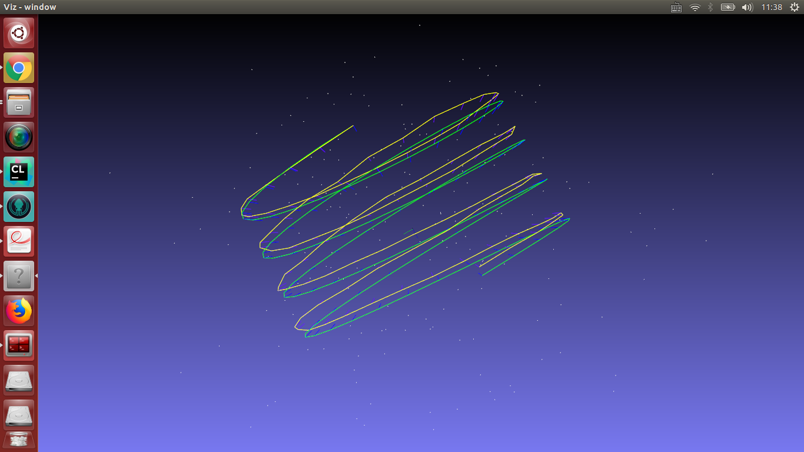

# ORB-SLAM第一次作业
--------------
[TOC]

## 第一题
通过两帧间特征点的匹配求解F矩阵，并恢复R，t。使用opencv的`findFundamentalMat`和`recoverPose`函数完成`demo/main.cpp`中的代码，实现基于2D-2D的视觉里程计。

* 代码
``` cpp 
// TODO homework
// estimate fundamental matrix between frame i-1 and frame i, then recover
// pose from fundamental matrix
{
  Eigen::Matrix3d R;
  Eigen::Vector3d t;

  cv::Mat cv_F = cv::findFundamentalMat(point_last, point_curr);
  cv::Mat cv_E = cv_K.t() * cv_F * cv_K;
  cv::Mat cv_R, cv_t;
  cv::recoverPose(cv_E, point_last, point_curr, cv_K, cv_R, cv_t);
  std::cout << cv::norm(cv_t) << std::endl;
  cv_t = cv_t / cv::norm(cv_t) * t_scale;
  std::cout << cv::norm(cv_t) << std::endl;
  cv::cv2eigen(cv_R, R);
  cv::cv2eigen(cv_t, t);
  Eigen::Matrix4d Tcl = Eigen::Matrix4d::Identity();
  Tcl.block(0, 0, 3, 3) = R;
  Tcl.block(0, 3, 3, 1) = t;

  // Twc = Twl * Tlc (c: current, l: last)
  Twc_curr = Twc_last * Tcl.inverse();
}
```

* 效果

白色点为landmarks，绿色以及黄色轨迹分别是仿真的真值以及VO的估计轨迹。


